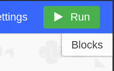
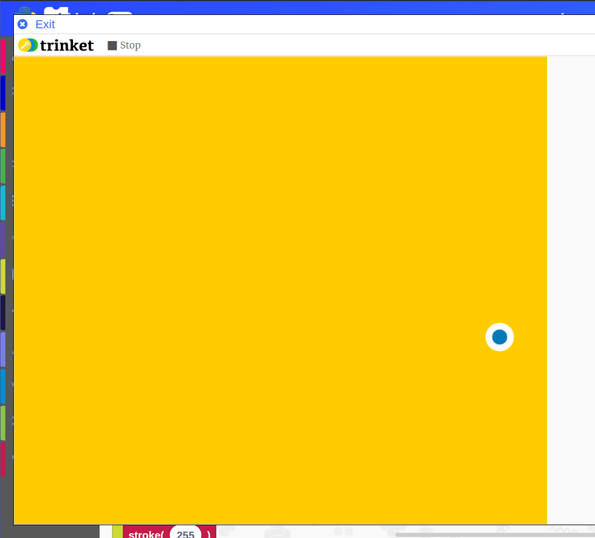

# Getting started with Python 3

## What is the Python 3 mode?

The micro:bit mode within EduBlocks allows you to code in Python 3 directly from the web browser using a drag and drop interface. 

## What is Python 3
Duration: 2:00

Python is a powerful multi-purpose programming language created by Guido van Rossum.
It has simple easy-to-use syntax, making it the perfect language for someone trying to learn computer programming for the first time.

### The EduBlocks Python 3 mode offers:

* Text on the blocks: Python code is displayed on the blocks so as you're coding in a familiar block environment, you're learning the Python syntax.
* Install free: The Python 3 mode is web based, meaning it's completely install free. All you need is an internet connection to start coding. It's cross-platform too!
* Teaches core python: The Python 3 mode covers all the core python syntax/concepts helping you feel more comfortable when coding the real thing.
* Turtle Support: Code Python Turtle with EduBlocks on the web. Draw shapes, create cool graphics and more using python code and the turtle library!
* Python text view: Create your Python code in the block editor, and with a click, you can switch to a Python text editor. You can also download the .py file too!
* Create Graphs: Python is known for it's use within data science. The Python 3 mode has support for PyGal, a python graph creation library allowing you to easily create graphs.

## Launching the Python 3 mode
Duration: 3:00

So, you want to get started with EduBlocks and Python 3? 

You can do this by opening a web browser of your choice and typing [https://app.edublocks.org](https://app.edublocks.org) into the search box. Once you've loaded up EduBlocks, you'll be presented with the mode selector. 

Now, we want to select the Python 3 mode. To do this simply click on the blue select button underneath the Python icon. This will load up the Python mode.

Once you've selected the Python mode, you should see it pop up:

## Loading up samples
Duration: 3:00

Once inside the Python 3 mode, we have a range of different things we can do. Before you write your own program it's a good idea to load up a sample so you can see how EduBlocks works.

To load up a sample, click the samples button in the blue navbar at the top, this will load up the following dialog box: 

Click on the blue open button next to the "Processing" sample. 
Once you've done this, a few blocks should appear in the workspace.

## Run Python 3 code
Duration: 2:00

Here is how to run code in the Python 3 mode:

Once you've completed your program, you can press the green run button in the top right hand corner to run your code.

This will load up a Python shell window in the browser where you'll see the output of your code.

